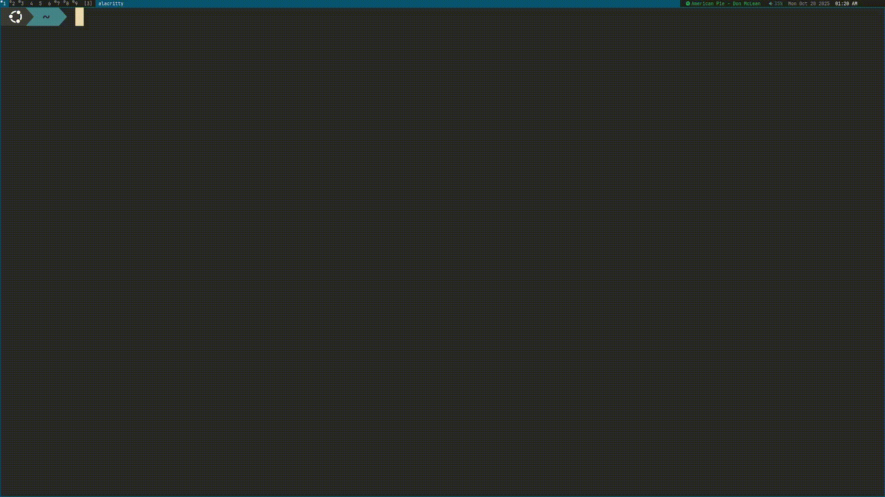

# 💬 Group Chat
This is a simple group chat program that runs in the command line, made with
C++ and the library ASIO. It is incredibly bare bones since this is the first
low-level networking project I have ever embarked on.



## 🪄 Usage
Unlike conventional messaging programs, this one requires you to run a command
every time you want to send or receive messages.

To send:
```bash
./client send
```
To receive:
```bash
./client get
```

You are also able to specify a hostname and a port when you run the command,
but depending on when you use this, you might be able to just leave them as the
default arguments. The default arguments will resolve to a server that I
currently have running, but I might eventually turn it off in a few weeks time
because I imagine nobody will be needing it.

## 🏗️ Building
Group Chat is built with C++ and the ASIO library. To build, you can:
* Clone the repo
* Run the configure script
* Run make

Or use this script
```bash
git clone https://github.com/kolin63/groupchat
cd groupchat
./configure
make client
```
